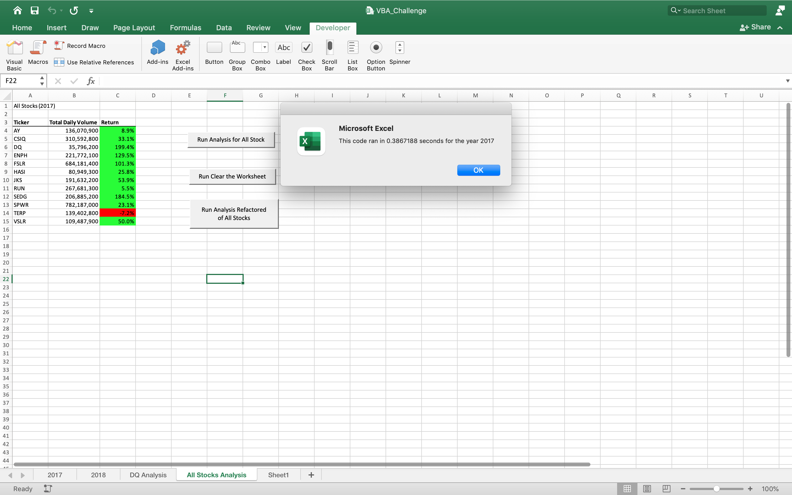
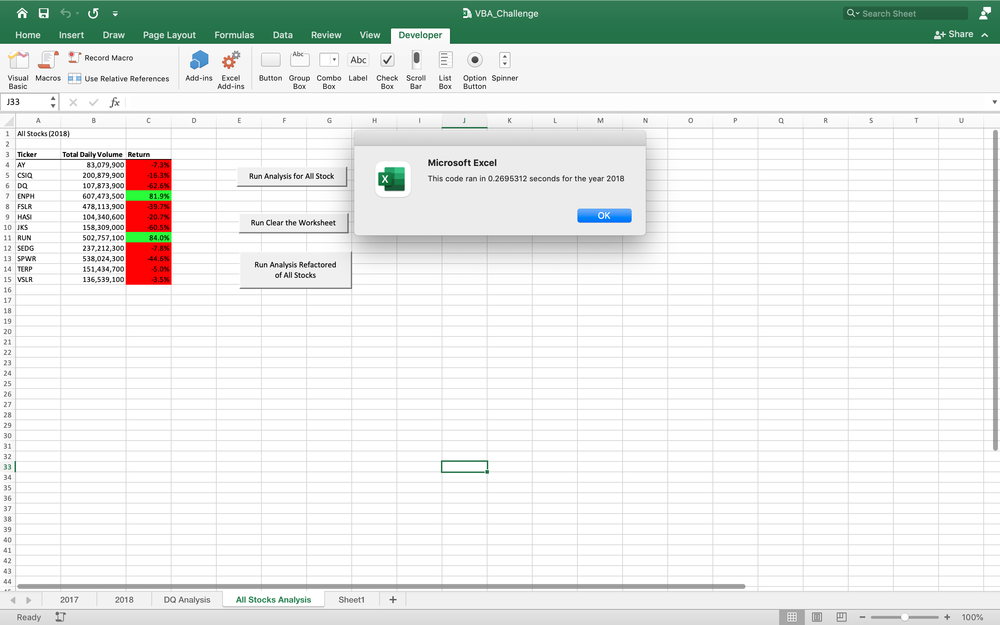

# Stocks-Analysis
Performing the analysis on All stocks for Steve's family by using VBA. 

## Overview of Project:
The purpose of this project is that to extract and analyze the data of stocks in 2017 and 2018 through VBA. The results can us to understand the implementation and expected development of stocks. Help Steve's parents know how to make the right investments.
The original VBA macro was only for the target processing data of 12 stocks. For efficient analysis of more data, it is necessary to refactor.

## Results:
The analysis is well described with screenshots and code 
Using images and examples of your code, compare the stock performance between 2017 and 2018, as well as the execution times of the original script and the refactored script.

* Original script
2017

* Refactored script

2017

2018

## Summary
1. Advantages and disadvantages of refactoring code in general

2. Advantages and disadvantages of the original and refactored VBA script

